# tdigestbench

Trying out various streaming histogram implementations in Go.  Please let me know if you have one you want me to test.
The ones I test are

* [caio/go-tdigest](https://github.com/caio/go-tdigest)
* [segmentio/tdigest](https://github.com/segmentio/tdigest)
* [influxdata/tdigest](https://github.com/influxdata/tdigest)

TL;DR

* Fastest: influxdata/tdigest
* Memory/allocation efficient: caio/go-tdigest and influxdata/tdigest
* Most accurate: caio/go-tdigest and sometimes influxdata/tdigest
* Least corner cases: caio/go-tdigest

# Usage

## Generate benchmarks
`make benchresult`

## Draw graphs
`make draw`

# Methodology

Each were configured with 1,000 compression.  If they cheat and use extra memory, this should show up in the total used
memory and speed metrics.

Numeric sources include random numbers, exponential distributions, repeating sequences, and linearly growing sequences.  Another
source, tailspike is a sequence that is normally low but tends to "spike" around 90% of the time.

# Results

All plots are drawn using [benchdraw](https://github.com/cep21/benchdraw) and generated on my home computer (Windows 4GHz 16GB RAM).
The raw data is inside [benchresult.txt](./benchresult.txt).

## Speed

Time it takes to create a digest of size 1,000,000.  Lower is better.  Here we see caio's implementation
takes longer than the rest and they all have variability depending upon the nature of the data.  Influxdata's
implementation appears to be the fastest.

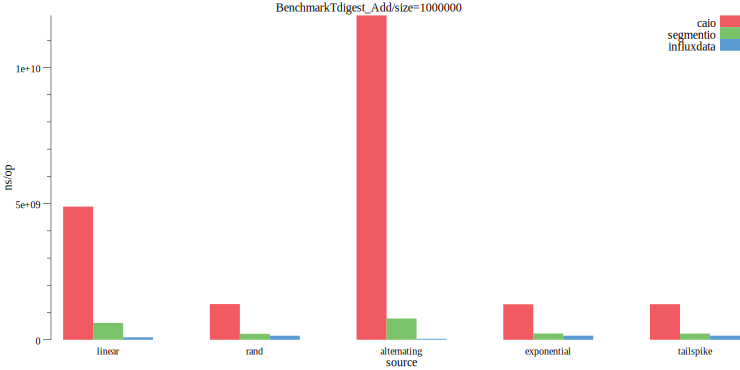

## Memory allocs

Memory allocations needed to create a digest of size 1,000,000.  Segmentio's implementation scales
allocations by the number of items in the digest, while caio's and influxdata's implementation are
mostly constant number of memory allocations.

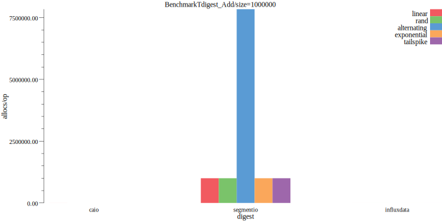

## Total used memory

Total amount of memory consumed after adding 100,000 items to the tdigest.   Lower is better.   Caio performs
poorly on linear data, while segmentio performed poorly on an alternating sequence of negative and positive values.

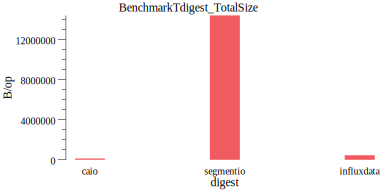

If we narrow total memory down to the exponential data series (which none handle too poorly), we see
caio's implementation uses much less memory.

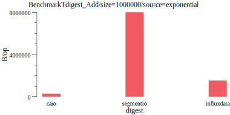

## Correctness

Percentage difference between the correct value (calculated via brute force) and the implemenation's value.  Lower is better.

% difference is calculated as `num := math.Abs(res - correct) / ((math.Abs(res) + math.Abs(correct)) / 2)` where `res`
is the result of the tdigest and `correct` is the correct value.  I borrowed this formula from [wikipedia](https://en.wikipedia.org/wiki/Relative_change_and_difference).

Here we see a large % difference for segmentio and influxdata on the tailspike data source at the 90%.  Caio's implementation
has no corner cases on any of my data sources or quantiles.

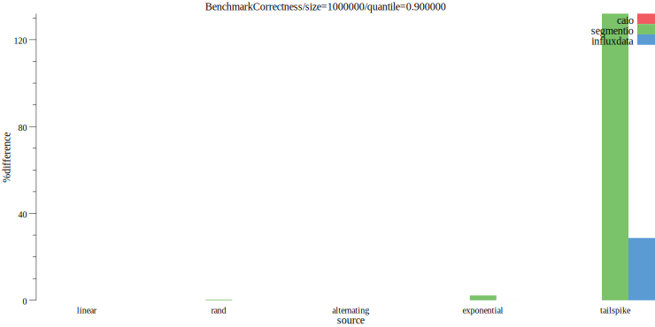

At the 99% things even out a bit.  Segmentio's implementation is still the least correct.

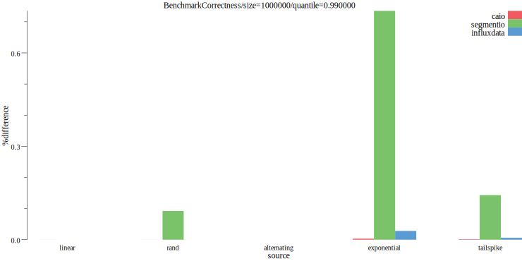

### Correctness by implementation

Correctness of influxdata/tdigest by all attempts.  Lower is better.  Here we see it performs poorly in the tailspike
data source for the 90%, slightly off for the exponential distribution, but not poorly for the rest.

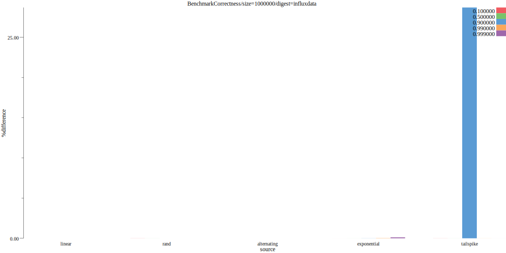

Correctness of caio/go-tdigest by all attempts.  Lower is better.  Here we see it performs very well among most data
sources (the X axis peeks at .02%), with a slight peek at .02% for the 10% quantile on linear data.

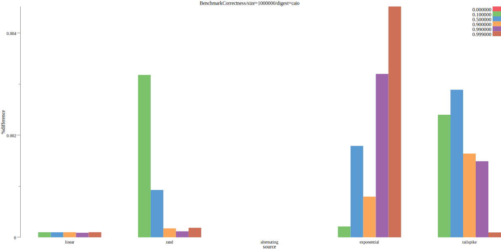

Correctness of segmentio/tdigest by all attempts.  Lower is better.  Here it performs poorly on the tailspike data
source, which makes it harder to notice the rest.

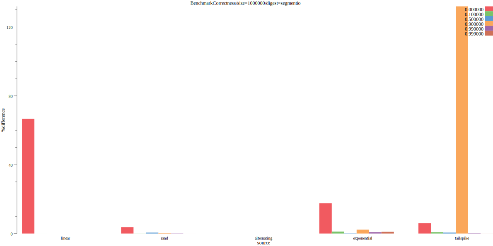

All correctness benchmarks at the same time.  Lower is better.  The text is hard to read for each type, but caio's
implementation is clustered on the left (at all close to zero), then segmentio's implementation, then influx's.

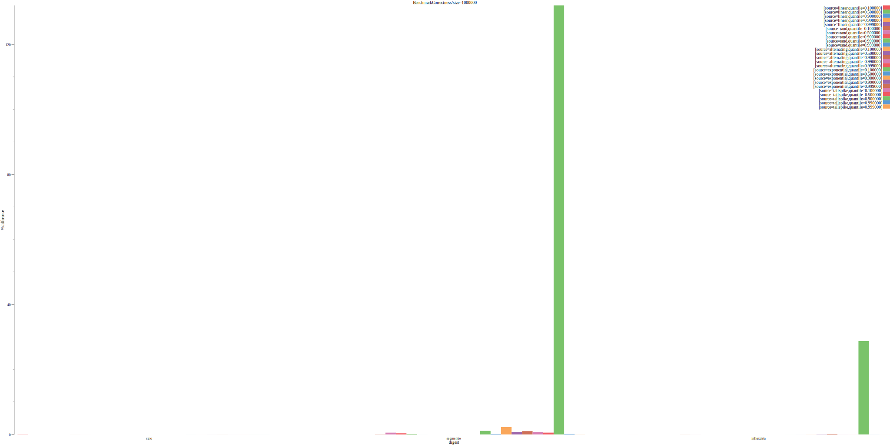

## Exponential distribution

Narrowing down to just the exponential distribution, caio and influxdata both do well while caio's implementation
is much more accurate across quantiles. 

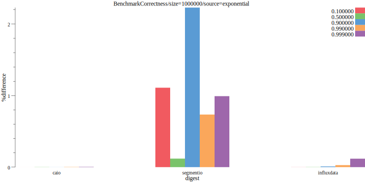

Looking at caio and influxdata individually.  Caio does reasonably well across distributions with a peek of
 .004% difference while influx's implementation tends to do worse in the higher quantiles and peeks at .1% difference.

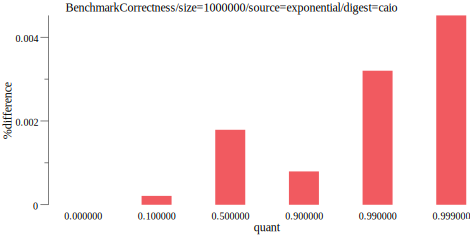
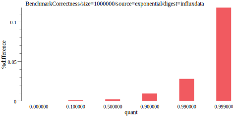

# Contributing

Contributions welcome!  Submit a pull request on github and make sure your code passes `make lint test`.  For
large changes, I strongly recommend [creating an issue](https://github.com/cep21/tdigestbench/issues) on GitHub first to
confirm your change will be accepted before writing a lot of code.  GitHub issues are also recommended, at your discretion,
for smaller changes or questions.

# License

This library is licensed under the Apache 2.0 License.