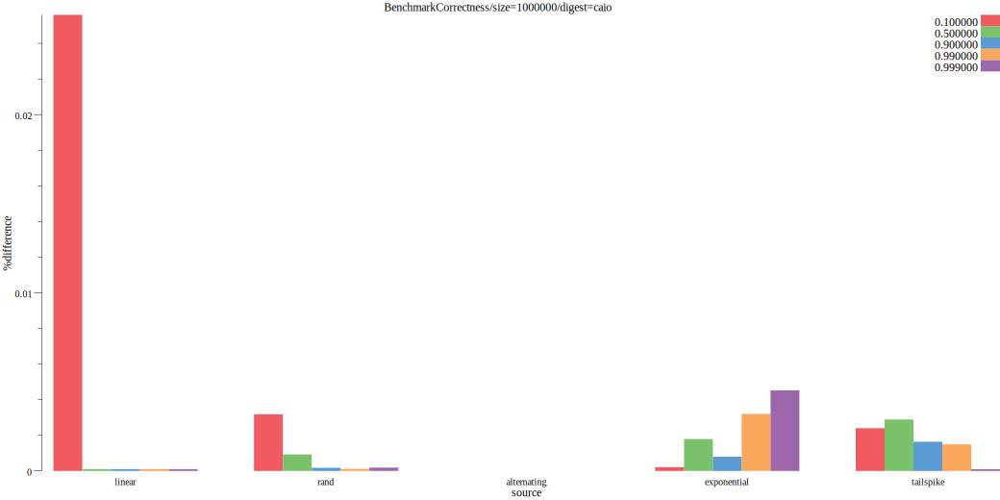
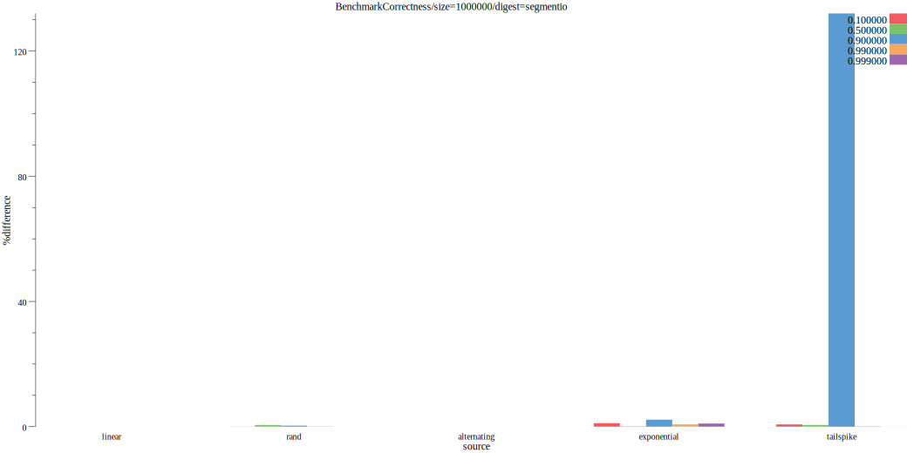

# tdigestbench

Trying out various streaming histogram implementations in Go.  Please let me know if you have one you want me to test.
The ones I test are

* [caio/go-tdigest](https://github.com/caio/go-tdigest)
* [segmentio/tdigest](https://github.com/segmentio/tdigest)
* [influxdata/tdigest](https://github.com/influxdata/tdigest)

# Usage

## Generate benchmarks
`make benchresult`

## Draw graphs
`make draw`

# Methodology

Each were configured with 1,000 compression.  If they cheat and use extra memory, this should show up in the total used
memory and speed metrics.

Numeric sources include random numbers, normal distributions, repeating sequences, linearly growing sequences, and
sequences that tend to "spike" 90% of the time.

# Results

All plots are drawn using [benchdraw](https://github.com/cep21/benchdraw) and generated on my home computer (Windows 4GHz 16GB RAM).

## Speed

Time it takes to add a single value to each tdigest.  Lower is better.

## Memory allocs

Memory usage to add a single value by stream type.  This graph is correct (both caio and influxdata use 0 allocs/op).

## Total used memory

Total amount of memory consumed used after adding 100,000 items to the tdigest.   Lower is better.  Here we can see
that even though I've configured influxdata's and caio's tdigest with 1,000 compression, the caio one uses less memory. 

## Correctness

How correctly each calculates a quantile for different types of data.  My metric for correctness is the % ratio of the
actual answer (calculated with brute force and storing every value in memory) and the library's answer.  Higher is better.

% difference is calculated as `num := math.Abs(res - correct) / ((math.Abs(res) + math.Abs(correct)) / 2)` where `res`
is the result of the tdigest and `correct` is the correct value.  I borrowed this formula from [wikipedia](https://en.wikipedia.org/wiki/Relative_change_and_difference).

### Correctness by implementation

Correctness of influxdata/tdigest by all attempts.  Higher is better.

Correctness of caio/go-tdigest by all attempts.  Higher is better.

Correctness of segmentio/tdigest by all attempts.  Higher is better.

All correctness benchmarks at the same time.  Higher is better.

# Contributing

Contributions welcome!  Submit a pull request on github and make sure your code passes `make lint test`.  For
large changes, I strongly recommend [creating an issue](https://github.com/cep21/tdigestbench/issues) on GitHub first to
confirm your change will be accepted before writing a lot of code.  GitHub issues are also recommended, at your discretion,
for smaller changes or questions.

# License

This library is licensed under the Apache 2.0 License.