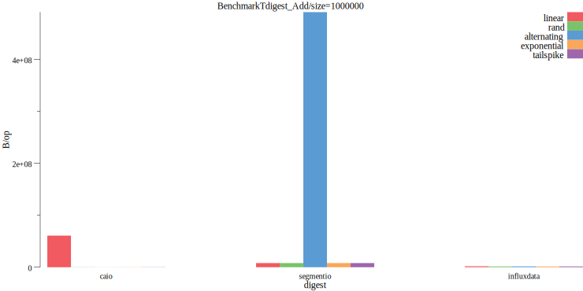
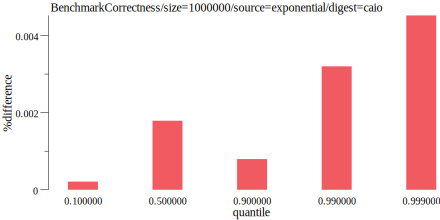
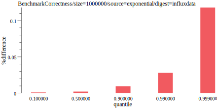

# tdigestbench

Trying out various streaming histogram implementations in Go.  Please let me know if you have one you want me to test.
The ones I test are

* [caio/go-tdigest](https://github.com/caio/go-tdigest)
* [segmentio/tdigest](https://github.com/segmentio/tdigest)
* [influxdata/tdigest](https://github.com/influxdata/tdigest)

# Usage

## Generate benchmarks
`make benchresult`

## Draw graphs
`make draw`

# Methodology

Each were configured with 1,000 compression.  If they cheat and use extra memory, this should show up in the total used
memory and speed metrics.

Numeric sources include random numbers, exponential distributions, repeating sequences, and linearly growing sequences.  Another
source, tailspike is a sequence that is normally low but tends to "spike" around 90% of the time.

# Results

All plots are drawn using [benchdraw](https://github.com/cep21/benchdraw) and generated on my home computer (Windows 4GHz 16GB RAM).
The raw data is inside [benchresult.txt](./benchresult.txt).

## Speed

Time it takes to add a single value to each tdigest.  Lower is better.

## Memory allocs

Memory usage to add a single value by stream type.  This graph is correct (both caio and influxdata use 0 allocs/op).

## Total used memory

Total amount of memory consumed used after adding 100,000 items to the tdigest.   Lower is better.  Here we can see
that even though I've configured influxdata's and caio's tdigest with 1,000 compression, the caio one uses less memory. 

## Correctness

Percentage difference between the correct value (calculated via brute force) and the implemenation's value.  Lower is better.

% difference is calculated as `num := math.Abs(res - correct) / ((math.Abs(res) + math.Abs(correct)) / 2)` where `res`
is the result of the tdigest and `correct` is the correct value.  I borrowed this formula from [wikipedia](https://en.wikipedia.org/wiki/Relative_change_and_difference).

Here we see a large % difference for segmentio and influxdata on the tailspike data source.

### Correctness by implementation

Correctness of influxdata/tdigest by all attempts.  Lower is better.  Here we see it performs poorly in the tailspike
data source for the 90%, slightly off for the exponential distribution, but close to 0% difference for the rest.

Correctness of caio/go-tdigest by all attempts.  Lower is better.  Here we see it performs very well among most data
sources (the X axis peeks at .004).  The worst case here is the 50% of the normal distribution.

Correctness of segmentio/tdigest by all attempts.  Lower is better.  Here it performs worse than others at most
data types, with an X axis that tops at 120.

All correctness benchmarks at the same time.  Lower is better.  The text is hard to read for each type, but caio's
implementation is clustered on the left (at all close to zero), then segmentio's implementation, then influx's.

## Exponential distribution

Narrowing down to just the exponential distribution, caio and influxdata both do well.

Looking at caio and influxdata individually.  Caio does reasonably well across distributions while influx's
implementation tends to do worse in the higher quantiles.

# Contributing

Contributions welcome!  Submit a pull request on github and make sure your code passes `make lint test`.  For
large changes, I strongly recommend [creating an issue](https://github.com/cep21/tdigestbench/issues) on GitHub first to
confirm your change will be accepted before writing a lot of code.  GitHub issues are also recommended, at your discretion,
for smaller changes or questions.

# License

This library is licensed under the Apache 2.0 License.